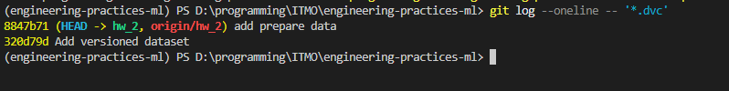
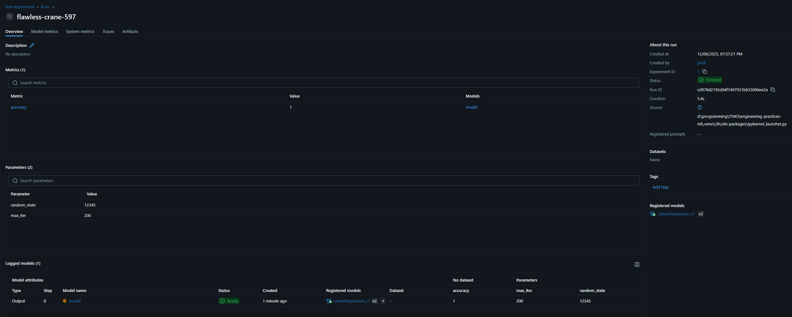
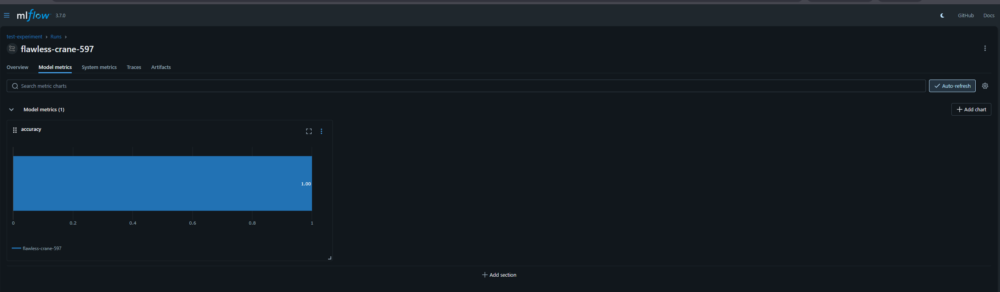

# Отчёт по домашней работе №2. Версионирование данных и моделей

<a target="_blank" href="https://cookiecutter-data-science.drivendata.org/">
    
</a>

## Работа с ветками

- `hw1` - Домашнее задание №1
- `hw2` - **Домашнее задание №2**
- `hw3` - Домашнее задание №3
- `hw4` - Домашнее задание №4
- `hw5` - Домашнее задание №5
- `hw6` - Домашнее задание №6


>Для версионирования данных использовался `DVC` для версионирования моделей использовался `MLFlow`

## Запуск окружения
```bash
uv venv

# Активация (Linux/macOS)
.venv/bin/activate

# Активация (Windows)
.venv\Scripts\activate

# Установка зависимостей из pyproject.toml
uv pip install -e .

# Либо через requirements.txt
uv pip install -r requirements.txt
```


## Настройка `DVC`

### Шаг 1. Инициализируем DVC
```bash
dvc init

git add .dvc/

git commit -m "Initialize DVC"
```

### Шаг 2. Добавление хранилища
```bash
dvc remote add -d myremote data

git add .dvc/config

git commit -m "Add local DVC remote"
```

### Шаг 3. Загрузка данных
```bash
dvc add data/
git add data.dvc .gitignore
git commit -m "Add versioned dataset"
dvc push  # загружает данные в remote
```



### Шаг 4. Выгрузка данных из удалённого хранилища
```bash
dvc pull
```

## Автоматизация выгрузки данных из `DVC`

В DockerFile основного проекта выполнятся `dvc pull` на этапе сборки

## Настройка `MLFlow`

### Шаг 1. Создаём папку mlflow

### Шаг 2. Запускаем MLFlow
```bash
mlflow server --backend-store-uri sqlite:///mlflow.db --default-artifact-root ./mlruns
```

### Пример эксперимента


### Пример метрик



### Пример загрузки эксперимента в `MLflow`

Данный код находится в ноутбуке `notebooks\linear_regression.ipynb`

```python
mlflow.set_tracking_uri("http://localhost:5000")
mlflow.set_experiment("test-experiment")

with mlflow.start_run():
    # Логируем метаданные
    mlflow.log_param("random_state", 12345)
    mlflow.log_param("max_iter", 200)
    mlflow.log_metric("accuracy", accuracy)

    # Логируем модель с сигнатурой
    signature = mlflow.models.infer_signature(test.drop(columns=["Id", "Species"]), model.predict(test.drop(columns=["Id", "Species"])))
    mlflow.sklearn.log_model(
        sk_model = model,
        name = "model",
        registered_model_name="LinearRegression_v1",
        signature=signature,
    )
```

## Запуск проекта в Docker

### Шаг 1. Запуск JupyterLab

```bash
docker-compose up --build
```
