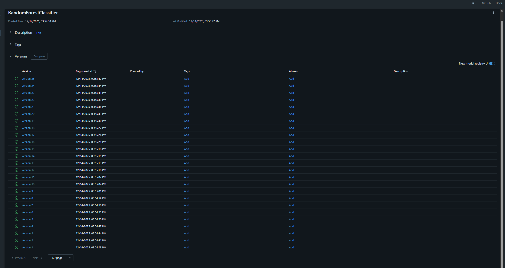
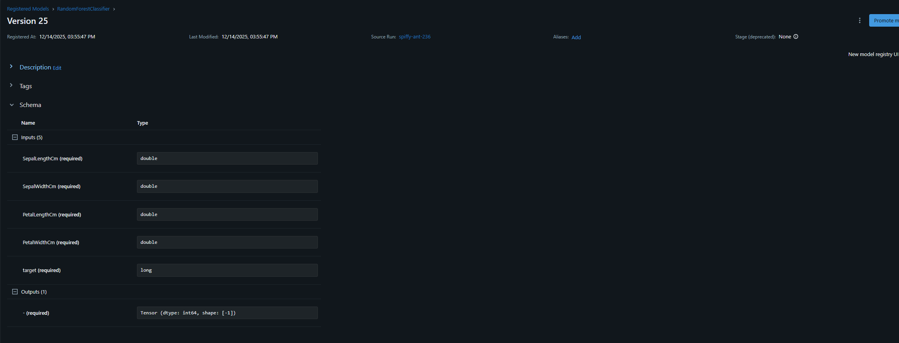
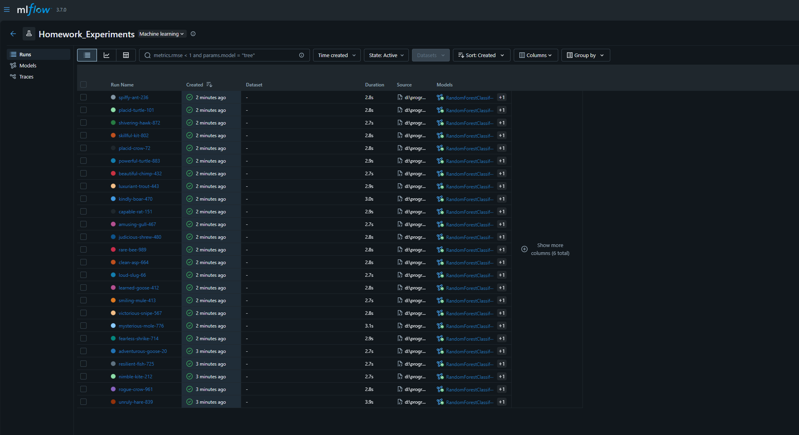
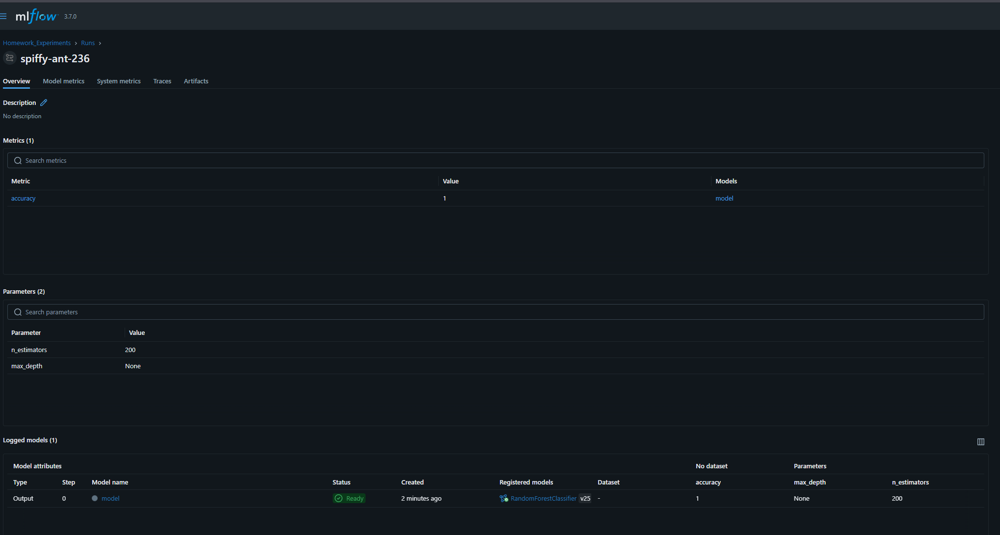

# Отчёт по домашней работе №3. Трекинг экспериментов

<a target="_blank" href="https://cookiecutter-data-science.drivendata.org/">
    
</a>

## Работа с ветками

- `hw1` - Домашнее задание №1
- `hw2` - Домашнее задание №2
- `hw3` - **Домашнее задание №3**
- `hw4` - Домашнее задание №4
- `hw5` - Домашнее задание №5
- `hw6` - Домашнее задание №6


>Для трекинга экспериментов используется `MLFlow`

## Запуск окружения
```bash
uv venv

# Активация (Linux/macOS)
.venv/bin/activate

# Активация (Windows)
.venv\Scripts\activate

# Установка зависимостей из pyproject.toml
uv pip install -e .

# Либо через requirements.txt
uv pip install -r requirements.txt

# Либо
uv sync
```

## Шаг 1. Выгрузка данных из удалённого хранилища
```bash
dvc pull
```

## Шаг 2. Запуск `MLFlow`
```bash
cd mlflow

mlflow server --backend-store-uri sqlite:///mlflow.db --default-artifact-root ./mlruns
```

## Шаг 3. Создание различных экспериментов (более подробно можно посмотреть в `notebooks/experiments.ipynb`)

```py
# Создаём или выбираем эксперимент
mlflow.set_tracking_uri("http://127.0.0.1:5000")
mlflow.set_experiment("Homework_Experiments")


# Проводим 15+ экспериментов
for n_est in [10, 50, 100, 150, 200]:
    for depth in [3, 5, 7, 10, None]:
        with mlflow.start_run():
            params = {"n_estimators": n_est, "max_depth": depth}
            mlflow.log_params(params)

            model = RandomForestClassifier(**params, random_state=42)
            model.fit(X_train, y_train)
            y_pred = model.predict(X_test)
            acc = accuracy_score(y_test, y_pred)
            mlflow.log_metric("accuracy", acc)

            signature = mlflow.models.infer_signature((X_test), model.predict(X_test))
            # Сохраняем модель как артефакт
            mlflow.sklearn.log_model(
                sk_model = model,
                name = "model",
                registered_model_name="RandomForestClassifier",
                signature=signature,
            )
```

## Результат экспериментов

### Версии моделей



### Сигнатура модели



### Эксперименты


### Метрики

