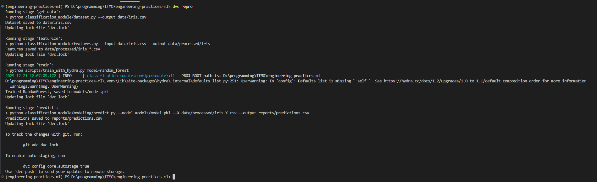
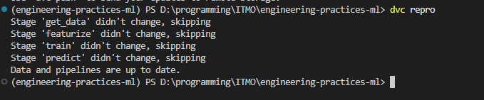

# Отчёт по домашней работе №4

<a target="_blank" href="https://cookiecutter-data-science.drivendata.org/">
    
</a>

## Работа с ветками

- `hw1` - Домашнее задание №1
- `hw2` - Домашнее задание №2
- `hw3` - Домашнее задание №3
- `hw4` - **Домашнее задание №4**
- `hw5` - Домашнее задание №5
- `hw6` - Домашнее задание №6


## Запуск окружения
```bash
uv venv

uv sync
```

## Выбранные инструменты

- **DVC Pipelines** - Data versioning pipelines
- **Hydra** - Configuration management framework


## Настройка DVC

### 1. Создан `dvc.yaml` и соответствующие скрипты для импорта данных, препроцессинга, обучения и прогнозирования

```yaml
stages:
  get_data:
    cmd: python classification_module/dataset.py --output data/iris.csv
    deps:
      - classification_module/dataset.py
    outs:
      - data/iris.csv

  featurize:
    cmd: python classification_module/features.py --input data/iris.csv --output data/processed/iris
    deps:
      - classification_module/features.py
      - data/iris.csv
    outs:
      - data/processed/iris_X.csv
      - data/processed/iris_y.csv

  train:
    cmd: python scripts/train_with_hydra.py model=random_forest
    deps:
      - scripts/train_with_hydra.py
      - classification_module/modeling/train.py
      - data/processed/iris_X.csv
      - data/processed/iris_y.csv
      - conf/config.yaml
      - conf/model/random_forest.yaml
    outs:
      - models/model.pkl

  predict:
    cmd: python classification_module/modeling/predict.py --model models/model.pkl --X data/processed/iris_X.csv --output reports/predictions.csv
    deps:
      - classification_module/modeling/predict.py
      - models/model.pkl
      - data/processed/iris_X.csv
    outs:
      - reports/predictions.csv

```


## Настройка Hydra для управления конфигурациями

### Создаём для примера следующую структуру папок
```tree
conf/
├── config.yaml
└── model/
    ├── random_forest.yaml
    └── logistic_regression.yaml
```

### Пример `random_forest.yaml`

```yaml
name: RandomForest
params:
  n_estimators: 100
  max_depth: 5
```

## Пример использования

### Шаг 1. Запускаем пайплайн

```bash
dvc repo
```




### Шаг 2. Повторный запуск пайплайна


