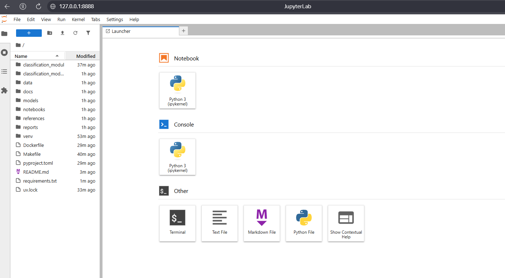

# Отчёт по домашней работе №1

<a target="_blank" href="https://cookiecutter-data-science.drivendata.org/">
    
</a>

## Структура проекта

```
├── LICENSE            <- Open-source license if one is chosen
├── Makefile           <- Makefile with convenience commands like `make data` or `make train`
├── README.md          <- The top-level README for developers using this project.
├── data
│   ├── external       <- Data from third party sources.
│   ├── interim        <- Intermediate data that has been transformed.
│   ├── processed      <- The final, canonical data sets for modeling.
│   └── raw            <- The original, immutable data dump.
│
├── docs               <- A default mkdocs project; see www.mkdocs.org for details
│
├── models             <- Trained and serialized models, model predictions, or model summaries
│
├── notebooks          <- Jupyter notebooks. Naming convention is a number (for ordering),
│                         the creator's initials, and a short `-` delimited description, e.g.
│                         `1.0-jqp-initial-data-exploration`.
│
├── pyproject.toml     <- Project configuration file with package metadata for
│                         classification_module and configuration for tools like black
│
├── references         <- Data dictionaries, manuals, and all other explanatory materials.
│
├── reports            <- Generated analysis as HTML, PDF, LaTeX, etc.
│   └── figures        <- Generated graphics and figures to be used in reporting
│
├── requirements.txt   <- The requirements file for reproducing the analysis environment, e.g.
│                         generated with `pip freeze > requirements.txt`
│
├── setup.cfg          <- Configuration file for flake8
│
└── classification_module   <- Source code for use in this project.
    │
    ├── __init__.py             <- Makes classification_module a Python module
    │
    ├── config.py               <- Store useful variables and configuration
    │
    ├── dataset.py              <- Scripts to download or generate data
    │
    ├── features.py             <- Code to create features for modeling
    │
    ├── modeling
    │   ├── __init__.py
    │   ├── predict.py          <- Code to run model inference with trained models
    │   └── train.py            <- Code to train models
    │
    └── plots.py                <- Code to create visualizations
```

--------

### Шаблон

Использовался `cookiecutter-data-science` в качестве шаблона с ручной настройкой

## Качество кода

### Настроены `pre-commit hooks` и создан файл `.pre-commit-config.yaml`
1. `Ruff` (линтер + автоисправление) - Анализирует все Python-файлы (*.py) на предмет:
   - Синтаксических ошибок (как SyntaxError)
   - Проблем стиля (PEP 8, именование, пробелы и т.д.)
   - Устаревшего кода (например, is вместо == для чисел)
   - Опасных паттернов (например, мутабельные аргументы по умолчанию)
   - С флагом --fix — автоматически исправляет всё, что можно (например, сортировка импортов, удаление неиспользуемых импортов, исправление цитат).
   - С флагом --exit-non-zero-on-fix — если были внесены исправления, хук завершается с ошибкой, и вы должны заново добавить (git add) файлы и повторить коммит.
2. `ruff-format` (форматтер)
   - Форматирует все Python-файлы в соответствии с настройками из `pyproject.toml`:
     - Длина строки (line-length)
     - Стиль кавычек ("double" или 'single')
     - Отступы (пробелы/табы)
     - Расстановка запятых, скобок, переносов и т.д.
   - Не принимает --fix, потому что ruff format всегда применяет изменения.
3. `trailing-whitespace`
   - Находит и удаляет лишние пробелы и табы в конце строк.
   - Такие пробелы:
     - Загрязняют диффы в Git
     - Могут вызывать предупреждения в некоторых редакторах
     - Не несут полезной информации
4. `end-of-file-fixer`
   - Гарантирует, что каждый файл заканчивается ровно одним символом новой строки (\n).

## Управление зависимостями

Используется `uv` для управления зависимостями

### Установка для Windows

```bash
powershell -c "irm https://astral.sh/uv/install.ps1 | iex"
```

### Запуск окружения
```bash
uv venv

# Активация (Linux/macOS)
.venv/bin/activate

# Активация (Windows)
.venv\Scripts\activate

# Установка зависимостей из pyproject.toml
uv pip install -e .

# Либо через requirements.txt
uv pip install -r requirements.txt
```
### Запуск JupyterLab проекта в Docker

### Шаг 1. Создать образ
```bash
docker build -t ml-project .
```

### Шаг 2. Запуск контейнера
```bash
docker run -p 8888:8888 ml-project
```


